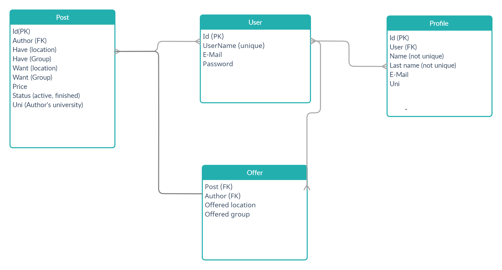

# savele_market
### Simple trading website for trading "savele-practice" class. Studens can put up posts containing their current location, group, price and in what they'd like to trade.
### Site has Users and Profile objects. Users and Profiles are onetoone relationship: after creating user (registering) user profile is created automatically. User has fields: usernname(unique), email, password. Profile has fields: name (non-unique), lastname, univeristy. On main page are posts displayed depending on user's university (students of different university can't trade locations). Also user can filter locations with given parameters.

# Requirements:
- python 3
- django 3.2.5
- bootstrap 4

# How to run:
## Database:
### In this project Mysql database is used.
- Create mysql database;
- In "savele_market/settings.py" file find field Databases;
```
DATABASES = {
    'default': {
        'ENGINE': 'django.db.backends.mysql',
        'NAME': 'db_name',
        'HOST': '127.0.0.1',
        'PORT': '3306',
        'USER': 'mysql_username',
        'PASSWORD': 'password',
    }
}
```
- Name - name of your database;
- User - mysql username;
- Password - mysql user password;
- After that go to main directory file: "savele_market/" and run following command: ``` python manage.py migrate ```
- Now our server is ready to run. In the same directory, run following command: ``` python manage.py runserver ```

# Database relationships:

- Every post has author (Foreign key of User object);
- Every offer has fields Post (offer made for (fk)), Author (User post made by (fk));
- Every profile has field User (User profile made for (fk));
  

